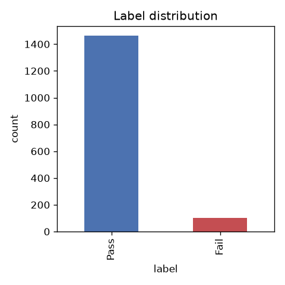
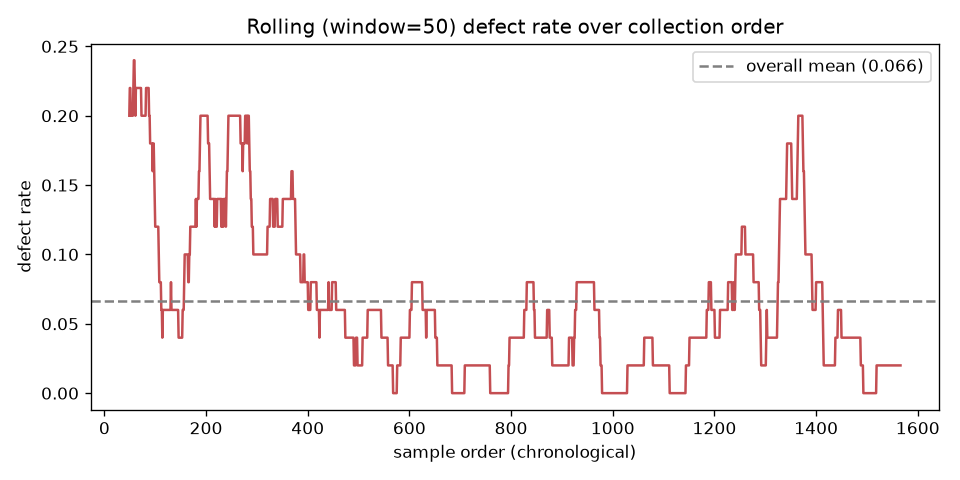
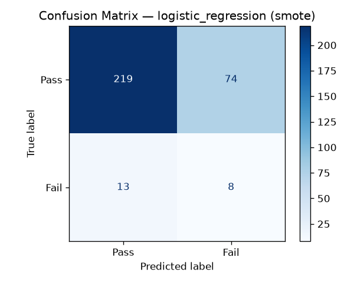
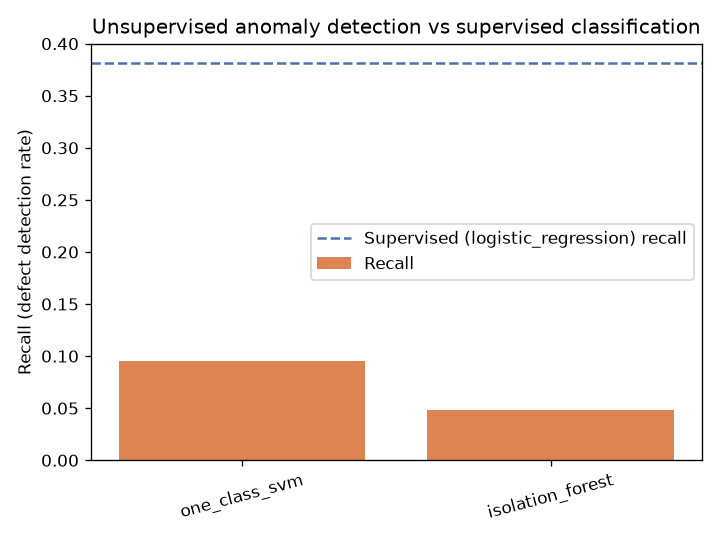

# SECOM 반도체 공정 불량 예측 프로젝트

**한 줄 요약**: 실제 반도체 제조 공정에서 나온 센서 데이터(590개 항목)를 분석해서, 웨이퍼가 검사 전에 불량이 될 가능성을 미리 예측하는 AI 모델을 만든 개인 프로젝트입니다.

- 데이터 출처: [UCI SECOM Data Set](https://archive.ics.uci.edu/dataset/179/secom) (공개 데이터, Kaggle에도 동일하게 게재됨)
- 사용 기술: Python, pandas, scikit-learn, XGBoost
- 전체 코드/결과: 이 저장소 그대로 실행하면 동일한 결과가 재현됩니다 ([실행 방법](#부록-직접-실행해보고-싶다면))

> 이 프로젝트는 **데이터를 먼저 충분히 들여다보고(EDA), 그 과정에서 발견한 사실을 실제 예측 모델에 반영하고 검증하는(머신러닝)** 전체 흐름을 직접 경험해보기 위해 진행했습니다. 아래에서 "왜 이걸 했는지"와 "무엇을 알아냈는지"를 순서대로 설명드립니다.

---

## 이 프로젝트가 푸는 문제

반도체 공정에서는 웨이퍼 하나가 만들어지는 동안 수백 개의 센서가 온도, 압력, 시간 같은 값을 계속 기록합니다. 이 센서 기록만 보고, **최종 검사를 하기 전에 "이 웨이퍼는 불량일 가능성이 높다"를 미리 알아낼 수 있는지**를 확인하는 것이 이 프로젝트의 목표입니다.

이게 가능해지면 실제 공정에서는:
- 불량 가능성이 높은 웨이퍼를 더 꼼꼼히 재검사하거나
- 문제가 되는 센서/공정 구간을 먼저 점검하는 식으로

**불량을 사후에 발견하는 대신 사전에 걸러내는 데 도움을 줄 수 있습니다.**

---

## 전체 진행 순서

```
1단계. 데이터를 뜯어본다 (EDA)         →  데이터의 특징과 함정을 파악
2단계. 머신러닝 모델을 만든다           →  실제로 예측이 가능한지 검증
3단계. 결과를 정직하게 해석한다         →  잘 된 점과 한계를 함께 정리
```

---

## 1단계. 왜 모델부터 만들지 않고 데이터를 먼저 뜯어봤는가 (EDA)

집을 짓기 전에 땅부터 파봐야 하듯, 데이터로 뭔가를 예측하기 전에는 **이 데이터를 믿어도 되는지, 어떤 함정이 있는지**를 먼저 확인해야 합니다. 이 단계를 EDA(탐색적 데이터 분석)라고 부릅니다. 확인 없이 바로 모델부터 돌리면, 데이터의 결함을 모델의 성능 문제로 착각하기 쉽습니다.

### 확인한 것들과 발견한 사실

**① 불량이 너무 적습니다.** 전체 1,567개 웨이퍼 중 불량은 104개(6.6%)뿐입니다. 이 사실을 놓치면 "정확도 93%"라는 숫자에 속기 쉽습니다 — 사실은 전부 "정상"이라고 찍기만 해도 나오는 숫자이기 때문입니다. 그래서 이 프로젝트에서는 정확도 대신 **"실제 불량 중 몇 개를 찾아냈는가"**를 기준으로 삼았습니다.



**② 결측치가 무작위가 아니라 뭉쳐서 나타납니다.** 센서값이 비어있는 컬럼 24개를 살펴보니, 무작위로 흩어져 있는 게 아니라 `109·110·111번`, `382·383·384번`처럼 **연속된 센서 번호끼리 뭉쳐서** 비어 있었습니다. 이는 개별 센서 고장이 아니라 **특정 계측 장비(다채널 센서 모듈) 하나가 특정 시점에 데이터를 못 남겼을 가능성**을 시사합니다. 실제 현업이라면 "이 장비군을 점검해보라"고 제안할 수 있는 단서입니다.

**③ 시간이 지날수록 불량률이 떨어지는 추세가 있었습니다.** 데이터가 수집된 3개월(2008년 7월~10월) 동안의 불량률을 시간 순으로 나눠보니, 앞 절반은 8.6%, 뒤 절반은 4.7%로 눈에 띄게 줄어들었습니다. 즉 **공정이 시간이 지나며 점점 안정화**되었다는 뜻입니다.



**④ "중요해 보이는" 센서들끼리도 사실 같은 정보를 담고 있었습니다.** 불량 예측에 도움이 될 만한 센서 상위 10개를 뽑아봤더니, 그중 일부는 서로 96%까지 거의 동일하게 움직이는 것으로 나타났습니다. 즉 "정보력 있는 센서 10개"처럼 보여도 실제로는 겹치는 정보가 많다는 뜻이며, 이는 데이터 전체가 겉보기보다 단순한 구조를 가지고 있을 수 있다는 근거이기도 합니다.

### EDA에서 실제 모델링으로 이어진 것

③에서 발견한 "시간이 지날수록 불량이 준다"는 사실을 그냥 관찰로 끝내지 않고, **"데이터 수집 시작일로부터 며칠이 지났는가"라는 새로운 변수(파생변수)를 직접 만들어서** 모델에 추가해봤습니다. 실제로 이 변수는 모델이 유의미하다고 판단해 채택했고, 예측 성능도 소폭 개선되었습니다 — EDA에서 눈으로 본 패턴이 실제로 모델 성능 개선까지 이어진 사례입니다.

---

## 2단계. 어떤 머신러닝 기법을 썼고, 왜 그런 결과가 나왔는가

이 프로젝트는 두 가지 방식을 각각 시도하고 비교했습니다.

| 방식 | 하는 일 | 이 프로젝트에서의 이름 |
|---|---|---|
| **지도학습 (분류)** | "정상/불량" 정답을 이미 아는 과거 데이터로 학습해서, 새 웨이퍼가 나오면 정상인지 불량인지 예측 | 양불 판정 |
| **비지도학습 (이상탐지)** | 정답(라벨) 없이, "정상 패턴"만 학습해서 여기서 벗어나는 것을 이상치로 판단 | 이상 탐지 |

### 왜 두 가지를 다 해봤는가
현업에서는 항상 정답 라벨이 충분한 것은 아닙니다. 라벨이 있을 때(지도학습)와 없을 때(비지도학습) 중 **어느 쪽이 실제로 더 쓸모 있는지 직접 비교**해보고 싶었습니다.

### 지도학습 (양불 판정) — 어떻게 진행했는가

1. **불균형 문제 먼저 해결**: 불량이 6.6%뿐이라 아무 조치 없이 학습하면 모델이 "그냥 다 정상"이라고 찍어버립니다. 이를 보정하는 방법 3가지(SMOTE 등)를 비교해서 가장 나은 방법을 선택했습니다.
2. **모델 4종 비교**: Logistic Regression(단순한 통계 모델), Random Forest, XGBoost, SVM 4가지를 동일한 조건에서 비교했습니다.
3. **최종 모델 검증**: 학습에 전혀 쓰지 않은 데이터(전체의 20%)로 진짜 성능을 확인했습니다.

**결과**: 의외로 가장 단순한 모델인 **Logistic Regression**이 가장 좋은 성능을 보였습니다. 복잡한 모델(Random Forest, XGBoost)이 오히려 더 낮은 성능을 보였는데, 이는 데이터 양(1,567개)에 비해 변수(590개)가 너무 많아 복잡한 모델이 데이터를 "외워버리는" 과적합 현상 때문으로 해석됩니다. **"복잡한 모델이 항상 좋은 건 아니다"**라는, 데이터 규모를 고려해야 한다는 인사이트를 확인한 부분입니다.

최종적으로 실제 불량 21건 중 **8건을 사전에 찾아냈습니다.**



### 비지도학습 (이상 탐지) — 어떻게 진행했는가

정상 데이터만 모델에 보여주고 "정상 패턴"을 학습시킨 뒤, 여기서 벗어나는 웨이퍼를 이상치(=불량 후보)로 판단하는 두 가지 기법(Isolation Forest, One-Class SVM)을 시도했습니다.

**결과**: 라벨 없이 학습한 이상탐지는 지도학습 대비 불량 검출 성능이 약 1/4 수준에 그쳤습니다.



**인사이트**: 이 데이터셋에서는 **라벨이 조금이라도 있다면 지도학습을 쓰는 것이 명확히 유리**하다는 결론을 얻었습니다. 이상탐지는 "불량 사례가 아예 없는 신규 공정 초기" 같은 특수한 상황에서만 대안으로 고려할 만합니다.

---

## 이 프로젝트로 확인/연습한 것

- **불균형 데이터를 다루는 경험**: 흔치 않은 사건(불량 6.6%)을 예측할 때 정확도가 아닌 올바른 평가 기준을 세우고, 이를 보정하는 방법을 비교·선택하는 과정
- **가설을 세우고 직접 검증하는 습관**: "시간이 지나며 불량이 준다"는 관찰을 파생변수로 만들어 실제로 성능이 개선되는지 교차검증으로 확인
- **여러 방법론을 공정하게 비교하는 절차**: 모델 4종, 이상탐지 2종을 동일한 조건에서 비교하고, 그 이유를 데이터 특성으로 설명
- **결과를 과장하지 않고 정직하게 해석하는 태도**: 성능 수치가 화려하지 않은 이유(데이터 자체의 낮은 신호 대 잡음비)와 한계를 숨기지 않고 기록

## 한계점 (숨기지 않고 정리)

- 변수(센서)들이 익명화되어 있어 "이 센서가 왜 중요한지" 실제 공정 지식으로 설명하기는 어려웠습니다.
- 불량 사례가 원래 적어서(104건), 검증에 쓰인 21건의 결과만으로는 성능 수치가 다소 흔들릴 수 있습니다.
- 이번 결과는 하나의 데이터 분할 기준이며, 조건을 바꾸면 수치가 달라질 수 있습니다.

더 자세한 수치와 비교표, 코드 구조는 [기술 상세 리포트](docs/TECHNICAL_REPORT.md)에서 확인하실 수 있습니다.

---

## 부록: 직접 실행해보고 싶다면

```bash
pip install -r requirements.txt
bash run_all.sh
```
시드를 고정해뒀기 때문에 재실행해도 이 문서에 적힌 수치와 동일한 결과가 나옵니다.
